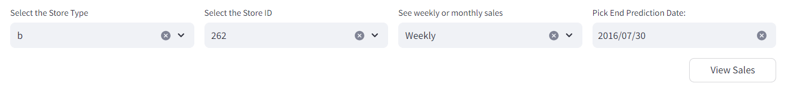
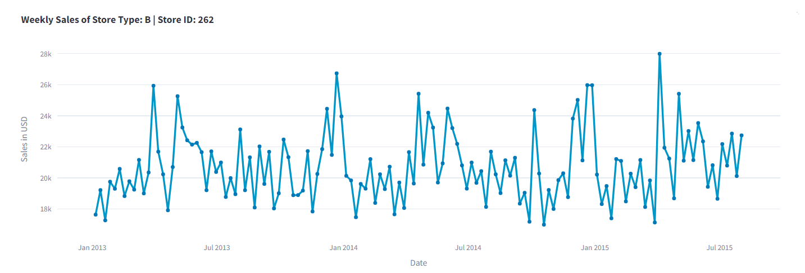
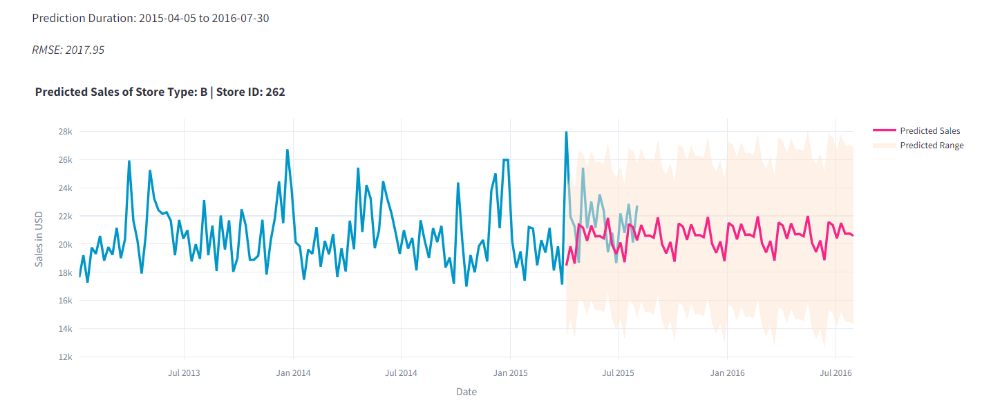

# Streamlit Application: Rossmann Sales Prediction using SARIMAX, Prophet 
## INFO7374: Final Project | Team 2: Adit Bhosale, Sowmya Chatti, Vasundhara Sharma

Welcome to the Rossmann Sales Prediction App! 🚀 This application leverages SARIMA and Prophet models to predict monthly and weekly sales up to a year based on the Rossman Sales data.

Access the Streamlit Application [here]().

### SARIMA
To predict sales using SARIMA, select the `store_type`, `store_id`, and choose whether you want to display weekly or monthly sales predictions. Enter the end prediction date, and the app will provide you with historical sales data and predicted sales data until the specified end date.

1. Customize your options
    

2. View hisorical sales

    

3. View Predicted Sales

    

